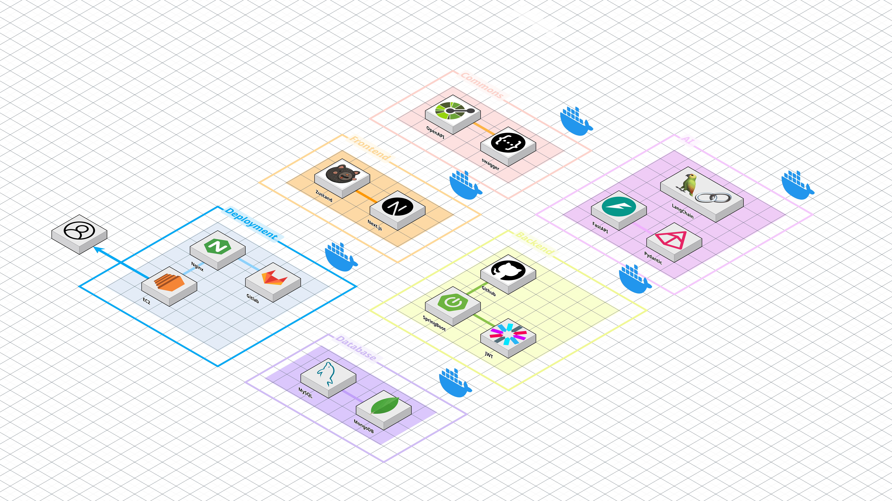

# 🤖 SCRUD 프로젝트
### Spring + JPA 개발자를 위한 AI 기반 코드 자동화 플랫폼

## 📋 프로젝트 소개

SCRUD는 Spring과 JPA 기반 프로젝트에서 반복적인 CRUD API 작성을 획기적으로 자동화하는 AI 기반 코드 생성 플랫폼입니다.
요구사항 명세서와 ERD만 입력하면, 프로젝트에 즉시 통합 가능한 고품질 코드를 자동으로 생성해 드립니다.

"반복적인 코드 작성에 시간을 낭비하지 마세요. 코덱스와 함께 창의적인 개발에 집중하세요."

## 🎯 이런 개발자분들에게 추천합니다
- **Spring과 JPA 프레임워크 기반으로 개발하는 개발자**
- **반복적인 CRUD API 작성에 시간을 투자하고 싶지 않은 개발자**
- **자신의 프로젝트 파일 구조에 맞게 코드를 생성하고 싶은 개발자**
- **코드 품질은 유지하면서 개발 속도를 높이고 싶은 개발자**

## 🌟 SCRUD의 차별점

- **프로젝트 맞춤형 코드 생성**: 단순한 템플릿이 아닌, 실제 프로젝트 구조와 컨벤션에 맞는 코드 생성
- **시각적 메서드 관계 도식화**: 복잡한 API 관계를 한눈에 파악
- **지능적인 코드 최적화**: AI 기반 코드 최적화 및 리팩토링 제안
- **효율적인 버전 관리**: 코드 변경 사항을 버전별로 추적 및 관리
- **즉시 사용 가능한 코드**: 복사 후 바로 프로젝트에 통합 가능한 고품질 코드 제공

## 🚀 주요 기능

### 📋 맞춤형 프로젝트 생성

- **간편한 프로젝트 생성**
  - 프로젝트 정보와 요구사항 명세서, ERD 그리고 나에게 꼭 맞는 프로젝트 생성

- **맞춤형 환경 설정**
  - 깃허브 연동을 통해 기존의 코드 스타일을 유지한 프로젝트를 생성
  - 의존성, 유틸 클래스, 에러코드, 보안 설정, 코드 컨벤션, 아키텍처 구조 설정 가능

### 🔧 AI 기반 API 자동 생성

- **요구사항 기반 API 명세 생성**
  - 요구사항 명세서를 분석하여 OpenAPI 3.0 기반의 YAML/JSON 파일 자동 생성 및 GUI 제공
  - 프로젝트에 필요한 다양한 API 엔드포인트를 한 번에 설계

- **맞춤형 API 직접 추가**
    - 사용자 친화적인 양식을 통한 API 쉽게 추가
    - HTTP 메서드, 경로(Path), 인증 여부, 쿼리 파라미터, 요청/응답 구조, 경로 변수, 페이지네이션 등 상세 설정

### 🖼️ 메서드 도식화 및 코드 생성
- **직관적인 메서드 관계 시각화**
    - Controller 메서드를 중심으로 관련 메서드들의 관계를 시각적으로 표현
    - 클릭 한 번으로 생성된 코드 전문 확인 및 복사 가능
- **Spring + JPA 코드 자동 생성**
    - API 명세와 프로젝트 설정을 기반으로 실제 실행 가능한 코드 자동 생성
    - Controller, Service, Repository 등 필요한 모든 컴포넌트 생성

### 🔄 코드 최적화 및 버전 관리

- **API 전체 프롬프팅**
    - 전체 API에 대한 일괄 수정 및 최적화
    - 새로운 버전으로 모든 컴포넌트 재생성
- **선택적 메서드 프롬프팅**
    - 특정 메서드만 선택하여 최적화 또는 리팩토링
    - 버튼 클릭 한 번으로 최적화, 리팩토링 등 수행
- **효율적인 버전 관리**
    - 프롬프팅 과정에서 생성된 모든 버전 기록 및 관리
    - 이전 버전과 현재 버전 간 비교 및 관리

### 📦 DTO 및 Entity 관리

- **데이터 구조 한눈에 파악**
    - 좌측 탭에서 메서드 간 데이터 전달에 필요한 DTO, Entity 확인
    - 클릭 한 번으로 필요한 클래스 코드 복사

## 🛠️ 기술 스택

### 백엔드
- **☕ Java/Spring Boot**: 서버 API 구현
- **🗄️ MySQL**: 데이터베이스
- **❎ MongoDB**: 데이터베이스
- **📝 OpenAPI 3.0**: API 문서화

### 프론트엔드
- **⚛️ NextJs**: 사용자 인터페이스

### 인프라
- **☁️ AWS**: 클라우드 서비스
- **🔄 CI/CD**: 지속적 통합 및 배포

## 📰 데이터 모델

주요 엔티티:
- 📖 ScrudProject: 프로젝트 정보
- 🪄 ApiSpecVersion: API 정보

## 🥰 팀원 정보

- 박준호 - Backend, Infra, AI
- 권  선 - Backend, Frontend
- 김나율 - Backend
- 박민제 - Frontend
- 정승국 - Frontend
- 조소현 - Frontend

## 프로젝트 아키텍처
